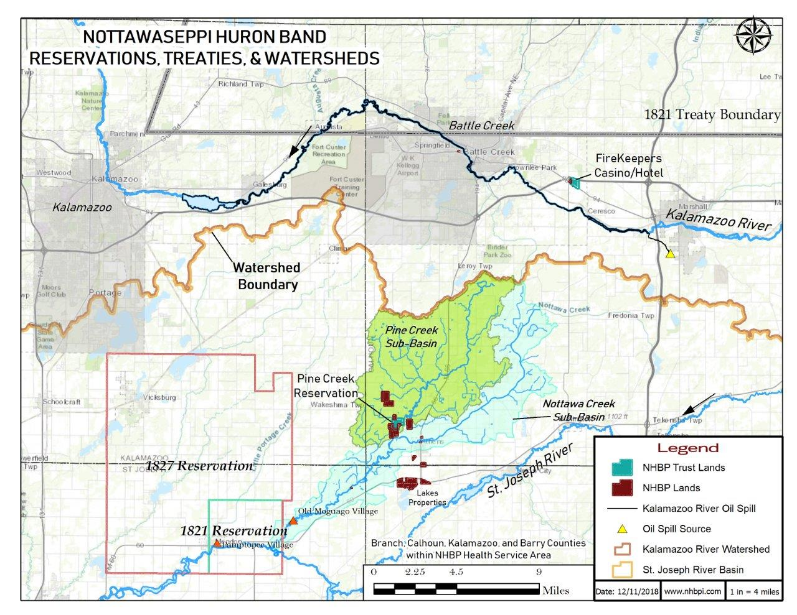

---
theme:
  path: catppuccin-custom.yaml
  override:
    default:
      colors:
        foreground: 74c7ec
---

<!-- alignment: center -->
<!-- new_lines: 3 -->
<!-- font_size: 6 -->
Hello I'm Eric!
<!-- font_size: 2 -->

Eric Kerney
   
Senior Application Developer - Blue Raster

<!-- end_slide -->

<!-- alignment: center -->
<!-- new_lines: 5 -->
I'm a Geospatial Developer &
---
Data Scientist
---
<!-- new_lines: 1 -->
<!-- font_size: 3 -->
**Over 15 years in Spatial Tech**     
<!-- font_size: 2 -->
1. NGO's 
2. Governments
3. Universities
4. Growth Stage Startups 
5. Custom Geo Software
<!-- new_lines: 1 -->
<!-- end_slide -->

<!-- alignment: center -->
<!-- new_lines: 3 -->
My Crew
---
<!-- new_lines: 1 -->

<!-- end_slide -->

<!-- alignment: center -->
<!-- new_lines: 3 -->
My Crew
---
<!-- new_lines: 1 -->

<!-- end_slide -->

<!-- alignment: center -->
<!-- new_lines: 3 -->
My Crew
---
<!-- new_lines: 1 -->

<!-- end_slide -->

<!-- alignment: center -->
<!-- new_lines: 5 -->
<!-- font_size: 5 -->
YES MICHIGAN!
<!-- font_size: 3 -->
<!-- new_lines: 1 -->

<!-- end_slide -->

<!-- alignment: center -->
<!-- new_lines: 3 -->
<!-- font_size: 5 -->
Airspace Link
<!-- font_size: 2 -->
- Safer drone integration into national airspace
- A New digital low-altitude infrastructure revolution
- Highways in the Sky 
<!-- new_lines: 1 -->
<!-- font_size: 2 -->
1. H3 - Solution Surface - Emergency Landings 
1. Automation of Data Deliverables 
2. Turn workflows into products/Apps/APIs
3. Data Infrastructure Demos
4. AirHub Marketplace Apps 
<!-- new_lines: 1 -->

<!-- end_slide -->

<!-- alignment: center -->
<!-- new_lines: 3 -->
Nottawaseppi Huron band of the Potawatomi
---
<!-- font_size: 2 -->
- Federally Recognized in 1995 
- Very small land base in original homelands 
- Feds, State, Local, Orgs, Agencies...
- Bodewadmi language nearly gone 
<!-- new_lines: 1 -->
<!-- font_size: 2 -->

<!-- end_slide -->

<!-- new_lines: 3 -->
Nottawaseppi Huron band of the Potawatomi
---
<!-- font_size: 2 -->
Water Resources & GIS Program    
Kalamazoo River Oil Spill      
Wild Rice 
New UAS Program     
Other Duties:
<!-- font_size: 1 -->
- Committees, Utilities, Planning, Cemeteries, Economic Efforts, Tribal Agriculture, Land Management, Environmental Assessment 

<!-- end_slide -->

<!-- alignment: center -->
<!-- new_lines: 5 -->
Other Background
---
<!-- font_size: 2 -->
- Started as Comp Sci in Undergrad 
- Master's in Geography @ WMU 
- Summer youth coordinator & GIS Tech 
- Kalamazoo River Watershed Council
- GIS made tech more visual and engaging 
<!-- new_lines: 1 -->
<!-- font_size: 2 -->
<!-- end_slide -->

<!-- alignment: center -->
<!-- new_lines: 5 -->
GIS => GeoDev
---
<!-- font_size: 3 -->
- Pushing boundaries with esri tech 
- Water Program automations 
<!-- font_size: 2 -->
  - Setup & calibration
  - Field Surveys
  - Live Maps & Dashboard 
  - Data Analysis
  - Submission to EPA WQX
  - Maps/Charts & Report Generation  
<!-- font_size: 3 -->
- IoT Air Quality Sensor data feeds 
- Covid/Remote Challenges 
- Building & Learning is fun!
<!-- end_slide -->

<!-- alignment: center -->
<!-- new_lines: 5 -->
Interesting Stuff
---
<!-- font_size: 3 -->
- Nature 
- Music 
- Bicycles 
- Gardening 
<!-- new_lines: 1 -->
<!-- font_size: 2 -->

<!-- end_slide -->

<!-- alignment: center -->
<!-- new_lines: 5 -->
<!-- font_size: 5 -->
Thank You!
<!-- font_size: 3 -->
Eric Kerney - Blue Raster
   
Senior Application Developer
<!-- font_size: 2 -->
ekerney@blueraster.com
<!-- font_size: 2 -->

<!-- end_slide -->
