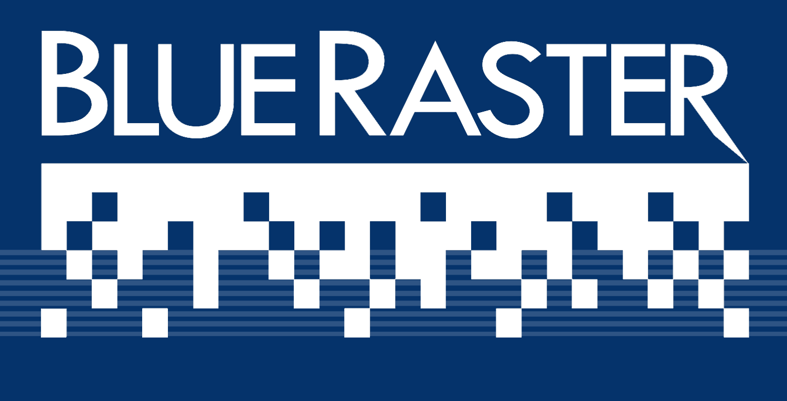

---
theme:
  path: catppuccin-custom.yaml
  override:
    default:
      colors:
        foreground: 74c7ec
---

<!-- alignment: center -->
<!-- new_lines: 6 -->
<!-- font_size: 5 -->
ArcGIS Experience Builder
<!-- font_size: 4 -->
For Developers: _Easy Edition_
<!-- font_size: 3 -->
IMAGIN/MiCAMP 2025 Conference
<!-- font_size: 2 -->
Kalamazoo, MI, Radisson Plaza
<!-- font_size: 2 -->
Eric Kerney - Blue Raster

<!-- end_slide -->

<!-- alignment: center -->
<!-- new_lines: 6 -->
What is Experience Builder???
---
<!-- new_lines: 1 -->
<!-- font_size: 3 -->
1. The Builder
<!-- new_lines: 1 -->
2. The Experience
<!-- new_lines: 1 -->
3. How are orgs using it?
<!-- new_lines: 1 -->
4. Why create a Custom Experience?
<!-- end_slide -->

<!-- new_lines: 6 -->
What Tech Do I Need???
---
<!-- new_lines: 1 -->
<!-- font_size: 3 -->
1. Modern Web Technologies
	1. HTML
	2. CSS 
	3. JavaScript
2. React
3. TypeScript
4. Terminal & Admin Access
5. Windows Subsystem 4 Linux 
6. OR || MacOS preferred
<!-- speaker_note: May want to mention my stack Mac, brew, ghostty, nvim, tmux, raycast, aerospace -->
<!-- speaker_note: React old Class Components vs Newer Functional Style -->
<!-- end_slide -->

<!-- new_lines: 6 -->
EXB Developer Edition 
---
<!-- new_lines: 1 -->
<!-- font_size: 3 -->
1. Terminal: nodeJS - npm - code editor
<!-- new_lines: 1 -->
2. EXB Dev Download 
<!-- new_lines: 1 -->
3. Server & Client Setup
<!-- new_lines: 1 -->
4. Start both Server + Client
<!-- end_slide -->

<!-- new_lines: 6 -->
Setting up with AGO/Enteprise
---
<!-- new_lines: 1 -->
<!-- font_size: 3 -->
1. Create Credentials in AGO
<!-- new_lines: 1 -->
2. Enter Creds into EXB
<!-- new_lines: 1 -->
3. Few Notes on Deployment
	1. Deploy to AGO/Enterprise
	2. Deploy to server/cloud
<!-- end_slide -->

<!-- new_lines: 6 -->
Shall we Get Started???
---
<!-- new_lines: 1 -->
<!-- font_size: 3 -->
1. Installs 
<!-- new_lines: 1 -->
2. Creds 
<!-- new_lines: 1 -->
3. Start
<!-- speaker_note: this is a speaker note -->
<!-- end_slide -->

<!-- new_lines: 6 -->
Taking a Look Around
---
<!-- new_lines: 1 -->
<!-- font_size: 3 -->
1. Familiar EXB Interface
<!-- new_lines: 1 -->
2. File Structure
<!-- new_lines: 1 -->
3. TypeScript
<!-- new_lines: 1 -->
4. React & Components
<!-- new_lines: 1 -->
5. Config Files
<!-- end_slide -->

<!-- new_lines: 6 -->
Custom Widgets
---
<!-- new_lines: 1 -->
<!-- font_size: 3 -->
1. Widget File Structure
<!-- new_lines: 1 -->
2. Interface with EXB App
<!-- new_lines: 1 -->
4. Working with Data Sources
<!-- end_slide -->

<!-- new_lines: 6 -->
Exploring Widgets
---
<!-- new_lines: 1 -->
<!-- font_size: 3 -->
1. ESRI github examples
<!-- new_lines: 1 -->
2. Any Widget Ideas?
<!-- end_slide -->
 

<!-- new_lines: 6 -->
Deploying Our Widget!
---
<!-- new_lines: 1 -->
<!-- font_size: 3 -->
1. Deploying to Enterprise
<!-- new_lines: 1 -->
2. Reusable Widgets
<!-- new_lines: 1 -->
3. Customize Styles & Data {props}
<!-- new_lines: 1 -->
4. Deploy to a Webserver
<!-- speaker_note: May want to mention my stack Mac, brew, ghostty, nvim, tmux, raycast, aerospace -->
<!-- end_slide -->
