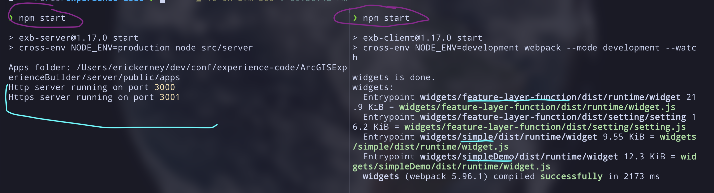
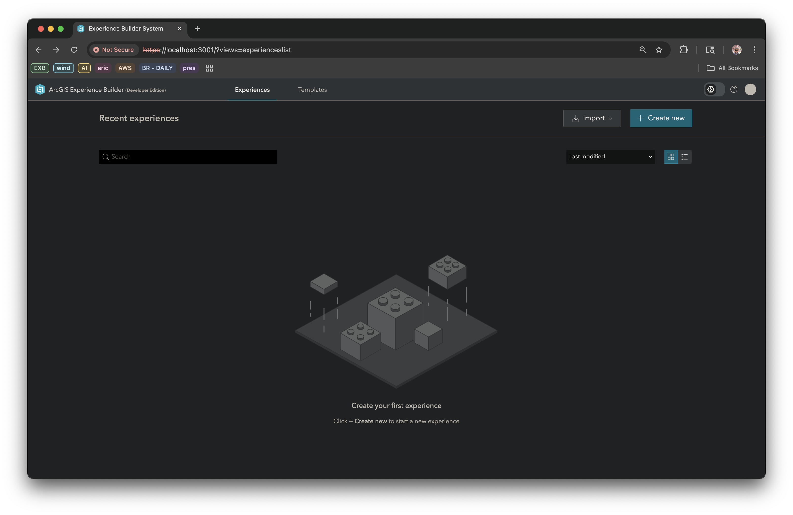

---
theme:
  path: catppuccin-custom.yaml
  override:
    default:
      colors:
        foreground: 74c7ec
---

<!-- alignment: center -->
<!-- new_lines: 4 -->
<!-- font_size: 5 -->
ArcGIS Experience Builder
<!-- font_size: 4 -->
For Developers: _Easy Edition_
<!-- font_size: 3 -->
IMAGIN/MiCAMP 2025 Conference
<!-- font_size: 2 -->
Kalamazoo, MI, Radisson Plaza
<!-- font_size: 2 -->
Eric Kerney - Blue Raster

<!-- end_slide -->

<!-- alignment: center -->
<!-- new_lines: 5 -->
What is Experience Builder???
---
<!-- new_lines: 1 -->
<!-- font_size: 3 -->
1. **The Builder**     
<!-- font_size: 2 -->
  1. build web apps without code.
<!-- font_size: 3 -->
2. **The Experience**
<!-- font_size: 2 -->
  1. highly configurable templates
<!-- font_size: 3 -->
3. **How is it Being Used?**
<!-- font_size: 2 -->
  1. variety of interactive applications     
<!-- font_size: 3 -->
4. **Why Custom Experiences?**
<!-- font_size: 2 -->
  1. out of the box functionality 
  2. stand out from the crowd
<!-- new_lines: 1 -->
<!-- font_size: 1 -->
* Experience Builder Overview: 
<!-- end_slide -->

<!-- new_lines: 4 -->
What Tech Do I Need???
---
<!-- font_size: 3 -->
1. Modern Web Technologies
<!-- font_size: 2 -->
  1. HTML
  2. CSS 
  3. JavaScript
<!-- font_size: 3 -->
2. React
3. TypeScript
4. ArcGIS Maps SDK
5. Terminal & Admin Access
6. Windows Subsystem 4 Linux 
7. OR || MacOS preferred
<!-- font_size: 1 -->
<!-- new_lines: 1 -->
* Experience Builder Overview: 
* W3Schools: 
* TypeScript: 
* React: 
* ArcGIS Maps SDK for JS: 
* How to Install Windows Subsystem for Linux: 
<!-- speaker_note: May want to mention my stack Mac, brew, ghostty, nvim, tmux, raycast, aerospace -->
<!-- speaker_note: React old Class Components vs Newer Functional Style -->
<!-- speaker_note: jimu exb api interface, jimu interfaces with Maps SDK -->
<!-- end_slide -->

<!-- new_lines: 5 -->
EXB Developer Edition 
---
<!-- new_lines: 1 -->
<!-- font_size: 3 -->
1. Terminal: nodeJS - npm - code editor
<!-- new_lines: 1 -->
2. EXB Dev Download 
<!-- font_size: 2 -->
  1. ArcGIS Online Enterprise 10.6 and later
<!-- new_lines: 1 -->
<!-- font_size: 3 -->
3. Two Services for EXB
<!-- new_lines: 1 -->
4. Running both Server + Client
<!-- end_slide -->

<!-- new_lines: 5 -->
Setting up with AGO/Enteprise
---
<!-- new_lines: 1 -->
<!-- font_size: 3 -->
1. Create Credentials in AGO
<!-- new_lines: 1 -->
2. Enter Creds into local EXB
<!-- new_lines: 1 -->
3. Few Notes on Deployment
<!-- font_size: 2 -->
  1. Deploy to AGO/Enterprise
  2. Deploy to server/cloud
<!-- end_slide -->

<!-- new_lines: 2 -->
Shall we Get Started???
---
<!-- font_size: 3 -->
1. Install

<!-- font_size: 1 -->
<!-- new_lines: 1 -->
* Experience Builder Downloads: 
* EXB Reslease Versions 
<!-- end_slide -->

Create Credentials
---
<!-- new_lines: 1 -->

<!-- end_slide -->

<!-- new_lines: 1 -->

Start Server & Client
---

<!-- new_lines: 1 -->
<!-- font_size: 1 -->
<!-- new_lines: 1 -->
<!-- speaker_note: A bit more difficult for developers to test custom EXB, no dev account access-->
<!-- speaker_note: Run thgrough creating and registering a new application on AGO -->
<!-- end_slide -->

<!-- new_lines: 6 -->
Taking a Look Around
---
<!-- new_lines: 1 -->
<!-- font_size: 3 -->
1. Same EXB Interface
<!-- new_lines: 1 -->
2. File Structure Tour
<!-- new_lines: 1 -->
3. TypeScript
<!-- new_lines: 1 -->
4. React & Components
<!-- new_lines: 1 -->
5. EXB Widget Config Files
<!-- speaker_note: Use VSCode as a file tree viewer -->
<!-- end_slide -->

<!-- new_lines: 6 -->
Custom Widgets
---
<!-- new_lines: 1 -->
<!-- font_size: 3 -->
1. Review Sample Widget
<!-- new_lines: 1 -->
2. Create New Simple Widget
<!-- new_lines: 1 -->
3. Clone ESRI Widget Samples
<!-- font_size: 1 -->
<!-- new_lines: 2 -->

* EXB github repo: 
<!-- end_slide -->

<!-- new_lines: 6 -->
Deploying Our Widget!
---
<!-- new_lines: 1 -->
<!-- font_size: 3 -->
1. Deploying to Enterprise
<!-- speaker_note: Deploy ArcGIS Enterprise OR Developer Edition/webserver -->

<!-- end_slide -->

<!-- new_lines: 6 -->
Deploying Our Widget!
---
<!-- new_lines: 1 -->
<!-- font_size: 3 -->
1. Developer Edition Webserver

<!-- speaker_note: Deploy options - S3, Amplify, github pages -->
<!-- end_slide -->

<!-- alignment: center -->
<!-- new_lines: 5 -->
<!-- font_size: 5 -->
Thank You!
<!-- font_size: 3 -->
Eric Kerney - Blue Raster
   
Senior Application Developer
<!-- font_size: 2 -->
ekerney@blueraster.com
<!-- font_size: 2 -->

<!-- end_slide -->
